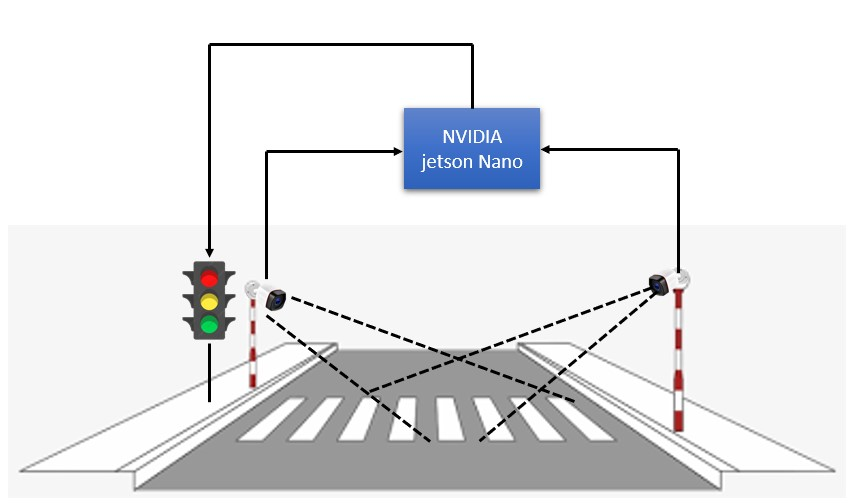

# Smart-Traffic-Light-for-pedestrian-safety
This repo contains the python code for Smart traffic light project.

## Description
This project was initiated to make sure vehicles coming towards the zebra crossing get warning signal if a person is crossing the road.This system will enhance the safety of pedestrians especially during night conditions or when the visibility is very low and vehicle driver is not able to see if the road is clear or not. This system can be integrated with existing traffic signal system as a added functionality.


### Conditions and regions
This system manipulates three signal, Vehicle red, Vehicle Green and Pedestrain Green for each lane.

Three regions are created on each lane of the road, Waiting_area_1, Main_Area, Waiting_Area_2.If a person is present in Waiting_Area_1 or Waiting_Area_2 the Pedestrain green and vehicle green signal blinks with some frequency indicating the state change and warning to the pedestrain and to the vehicle driver that person is about to enter into the the zebra crossing so, GO SLOW!!

If the person commits to the zebra cross and enter into the Main_Area, the pedestrain signal turns green allowing pedestrian to walk across the road but the vehicle signal turns red and warns the driver to slow down and stop the vechicle before zebracross and let that person cross the road. After the person safely crosses the road, vehicle signal turns green allowing vehicel to go and pedestrian signal stops being green.

following picture shows the schematic of the system.


### How it's done
The video obtained from the camera is used for person detection on the zebra crossing using [jetson-inference](https://github.com/dusty-nv/jetson-inference) and above mentioned conditions are checked.


## Installations
First, install the latest version of [JetPack](https://developer.nvidia.com/embedded/jetpack) on your Jetson.

Then, follow the steps below to install the needed components on your Jetson.

### jetson-inference

This system uses the DNN objects from the [jetson-inference](https://github.com/dusty-nv/jetson-inference) project (aka Hello AI World). To build and install jetson-inference, see [this_page](https://github.com/dusty-nv/jetson-inference/blob/master/docs/building-repo-2.md) or run the commands below:

```

$ cd ~
$ sudo apt-get install git cmake
$ git clone --recursive https://github.com/dusty-nv/jetson-inference
$ cd jetson-inference
$ mkdir build
$ cd build
$ cmake ../
$ make -j$(nproc)
$ sudo make install
$ sudo ldconfig

```
Before proceeding, it's worthwhile to test that [jetson-inference](https://github.com/dusty-nv/jetson-inference)  is working properly on your system by following this step of the Hello AI World tutorial:

* [Classifying Images with ImageNet](https://github.com/dusty-nv/jetson-inference/blob/master/docs/imagenet-console-2.md)


### Jetson.GPIO

Follow [this_page](https://pypi.org/project/Jetson.GPIO/#:~:text=In%20order%20to%20use%20the,to%20the%20newly%20created%20group.&text=Install%20custom%20udev%20rules%20by%20copying%20the%2099%2Dgpio.) for manual installation or run following command

```
sudo pip install Jetson.GPIO
```

Openup python shell to check correct installation by running following command

```
import Jetson.GPIO as GPIO
```

### numpy

Run following command

```
pip install --user numpy
```

### jetson-utils

Run following command

```
pip install --user jetson-utils
```

Openup python shell to check correct installation by running following command

```
import jetson-utils
```

### OpenCV

Run following command

```
pip install --user opencv-python
```

Openup python shell to check correct installation by running following command

```
import cv2
```

## Setting up regions

After setting up cameras on desired locations from where clear view of lane is visible capture a frame and save to local directory for setting up the regions.

### For saving a frame from live feed or video 

Run [capture_frame_from_video.py](https://github.com/patweatharva/Smart-Traffic-Light-for-pedestrian-safety/blob/main/capture_frame_from_video.py) after giving path to the video file or giving usb address of the camera connected.

press 'x' to capture a frame

The frame is then stored into the current working directory.

### For getting region coordinates

Run following python script to get the co-ordinates of the regions

[region_coordinates.py](https://github.com/patweatharva/Smart-Traffic-Light-for-pedestrian-safety/blob/main/region_coordinates.py)

Click on the window to get the coordinates of the region and note them and move onto the next step

### Putting coordinates in code

In [main.py](https://github.com/patweatharva/Smart-Traffic-Light-for-pedestrian-safety/blob/main/main.py) in the specified pts variable put the respective coordinates

 


## Running the script

Connect following hardware to the jetson nano

1. One or two cameras
2. Relay modules connected to respective pins as mentioned in the script
3. Lamps connected to the relay module
4. 5V 3A power supply to jetson nano


There, you have it!!! 

You have successfully implemented the program 

You can autorun the script in jetson nano using following steps

1. Openup Terminal
2. Run

```
crontab -e
```
3. At the end, put following command

```
@reboot python3 path/to/script
```
at the place of python3 put path to your python3 interpreter
